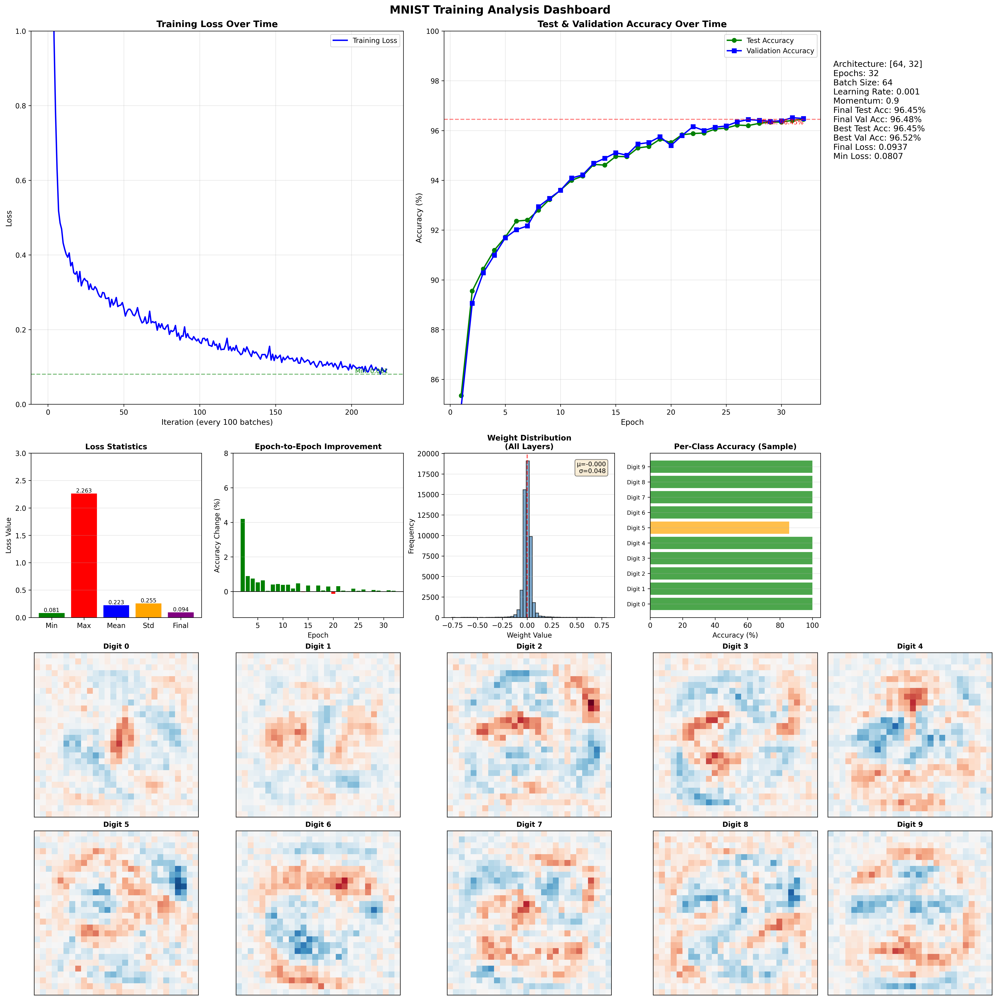

# MNIST_Python

[](https://www.python.org/downloads/)
[](https://pytorch.org/)
[](LICENSE)
[](https://github.com/seanbutler/AIOlogy/graphs/commit-activity)


A modular neural network training framework (currently targeting MNIST digit classification) with experiment management and comprehensive visualization.



*Example training visualization dashboard showing loss curves, accuracy metrics, weight distributions, and learned digit patterns*

## Features

- Configurable neural network architectures
- Comprehensive training visualization with 10+ plots per experiment
- Study-based experiment management for running multiple configurations
- Automatic result tracking and CSV export
- JSON-based configuration system
- Train/validation/test split with accuracy tracking

## Project Structure

```
├── main.py              # Simple entry point for single experiments
├── study.py             # Study class for running multiple experiments
├── experiment.py        # Core experiment runner
├── neural_network.py    # Neural network model definition
├── plotting.py          # Visualization and plotting functions
├── config_manager.py    # Configuration management utilities
├── config.json          # Base configuration file
└── data/                # MNIST dataset (auto-downloaded)
```

## Setup

1. Create virtual environment:
   ```bash
   python -m venv venv
   ```

2. Activate virtual environment:
   - Windows: `venv\Scripts\activate`
   - Linux/Mac: `source venv/bin/activate`

3. Install dependencies:
   ```bash
   pip install -r requirements.txt
   ```

## Usage

### Single Experiment

Run a single experiment using `config.json`:

```bash
python main.py
```

### Multiple Experiments (Study)

Create and run a study with multiple experiments:

```python
from study import Study

# Create a study
study = Study(
    name="architecture_comparison",
    description="Comparing different network architectures"
)

# Add experiments
study.add_experiment('baseline', hidden_layers=[64, 32], learning_rate=0.001, epochs=10)
study.add_experiment('wider', hidden_layers=[128, 64], learning_rate=0.001, epochs=10)
study.add_experiment('deeper', hidden_layers=[64, 32, 16], learning_rate=0.001, epochs=10)

# Run all experiments
results = study.run(verbose=True)

# Analyze results
study.print_summary()
best = study.get_best_result()
```

Or run the example study:

```bash
python study.py
```

### Configuration

Edit `config.json` to customize:

```json
{
  "model": {
    "hidden_layers": [64, 32],
    "input_size": 784,
    "output_size": 10
  },
  "training": {
    "epochs": 10,
    "batch_size": 64,
    "learning_rate": 0.001,
    "momentum": 0.9
  },
  "output": {
    "save_plot": true,
    "show_plot": false
  }
}
```

## Output Files

### Single Experiment
- `training_metrics_default_TIMESTAMP.png` - Comprehensive visualization
- Console output with training progress

### Study (Multiple Experiments)
- `study_STUDYNAME_TIMESTAMP.csv` - Results table
- `config_STUDYNAME_EXPNAME.json` - Individual experiment configs
- `training_metrics_STUDYNAME_EXPNAME_TIMESTAMP.png` - Per-experiment plots

## Visualizations

Each experiment generates a comprehensive dashboard including:
- Training loss over time
- Test & validation accuracy curves
- Loss statistics (min, max, mean, std)
- Epoch-to-epoch improvement
- Per-class accuracy analysis
- Weight distribution histogram
- Network weight patterns for each digit (0-9)
- Configuration summary

## Development

### Adding New Experiments

Use the Study class to organize related experiments:

```python
study = Study(name="learning_rate_study")
study.add_experiment('lr_low', learning_rate=0.0001, epochs=20)
study.add_experiment('lr_medium', learning_rate=0.001, epochs=10)
study.add_experiment('lr_high', learning_rate=0.01, epochs=10)
results = study.run()
```

### Programmatic Configuration

```python
from config_manager import create_config, update_config

# Create custom config
config = create_config(
    model_params={'hidden_layers': [128, 64, 32]},
    training_params={'epochs': 20, 'learning_rate': 0.01}
)

# Or update existing
config = update_config(config, hidden_layers=[256, 128], epochs=50)
```

## Dependencies

See `requirements.txt`:
- torch
- torchvision
- matplotlib
- numpy
